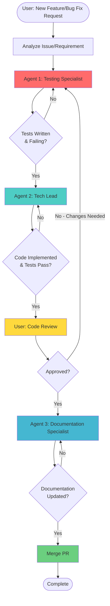

# 🔄 Agent Workflow Orchestration - Intelligent Heating Pilot

## 🎯 Overview

This document defines the **orchestrated workflow** for feature development and bug fixes in the Intelligent Heating Pilot project using specialized GitHub Copilot agents.

**Three specialized agents work in sequence**:

1. **Testing Specialist** → Writes tests (TDD Red phase)
2. **Tech Lead** → Implements code (TDD Green + Refactor)
3. **Documentation Specialist** → Updates documentation

## 🚀 Complete Development Workflow



## 📋 Workflow Phases

### Phase 1: Test Design (Testing Specialist) 🔴

**Trigger**: User requests feature or bug fix

**Agent**: `@testing-specialist`

**Objective**: Write comprehensive failing tests that define expected behavior

#### Actions:
1. **Analyze Requirement**
   - Read GitHub issue details
   - Understand user story
   - Identify affected domain components

2. **Design Test Scenarios**
   - Happy path (normal behavior)
   - Edge cases (boundaries)
   - Error cases (invalid input, missing data)
   - Architectural compliance checks

3. **Write Failing Tests**
   ```python
   # tests/unit/domain/test_new_feature.py
   def test_new_feature_happy_path():
       """Test Issue #XX: Feature works as expected."""
       # ARRANGE
       setup = create_test_setup()
       
       # ACT
       result = new_feature.execute(setup)
       
       # ASSERT (will FAIL until implemented)
       assert result.success is True
   ```

4. **Run Tests (RED State)**
   ```bash
   pytest tests/unit/domain/test_new_feature.py -v
   # Expected: FAILED (tests define behavior, not yet implemented)
   ```

5. **Document Test Expectations**
   - Create PR draft
   - List test files created/modified
   - Describe expected behavior in PR description

#### Deliverables:
- ✅ Failing test suite (RED phase)
- ✅ Test coverage for all scenarios
- ✅ PR draft with test documentation
- ✅ Architectural compliance tests

#### Hand-off to Tech Lead:
```markdown
✅ Tests ready for Issue #XX
- 5 tests written (3 unit, 2 integration)
- All tests failing as expected (RED phase)
- Files: tests/unit/domain/test_new_feature.py
- Ready for implementation
```

---

### Phase 2: Implementation (Tech Lead) 🟢

**Trigger**: Testing Specialist completes Phase 1

**Agent**: `@tech-lead`

**Objective**: Implement clean, DDD-compliant code that makes all tests pass

#### Actions:
1. **Analyze Tests**
   - Read all failing tests
   - Understand requirements from assertions
   - Identify affected layers (Domain/Infrastructure/Application)

2. **Plan Implementation**
   - Minimal changes to pass tests
   - Check for reusable patterns
   - Verify architectural boundaries

3. **Implement Code (TDD Green Phase)**
   - Start with domain layer (pure logic)
   - Create/update value objects
   - Implement domain services
   - Create infrastructure adapters
   - Wire up in application layer

4. **Run Tests Frequently**
   ```bash
   # After each small change
   pytest tests/unit/domain/test_new_feature.py -v
   # Goal: All tests GREEN
   ```

5. **Refactor Code (TDD Refactor Phase)**
   - Extract duplicated code
   - Improve naming
   - Simplify complex logic
   - Add docstrings and type hints
   - **Keep tests green throughout**

6. **Final Validation**
   ```bash
   # All tests pass
   pytest tests/ -v
   
   # No linting errors
   python -m mypy custom_components/intelligent_heating_pilot/
   
   # Coverage check
   pytest --cov=custom_components.intelligent_heating_pilot
   ```

#### Deliverables:
- ✅ All tests passing (GREEN phase)
- ✅ Clean, refactored code
- ✅ DDD architecture respected
- ✅ Complete type hints and docstrings
- ✅ No linting errors

#### Hand-off to User:
```markdown
✅ Implementation complete for Issue #XX
- All 5 tests passing (GREEN phase)
- Domain layer: New PredictionService with humidity compensation
- Infrastructure layer: Updated HAEnvironmentReader
- Application layer: Wired new service
- Coverage: 85% (domain), 70% (overall)
- Ready for code review
```

---

### Phase 3: Code Review (User) 👀

**Trigger**: Tech Lead completes Phase 2

**Reviewer**: User (Project Maintainer)

**Objective**: Validate implementation quality and correctness

#### Review Checklist:

##### Functionality
- [ ] Feature works as described in issue
- [ ] All acceptance criteria met
- [ ] No regression (existing features still work)
- [ ] Edge cases handled appropriately

##### Code Quality
- [ ] Code is readable and maintainable
- [ ] Functions are small and focused
- [ ] Naming is clear and consistent
- [ ] No code smells (duplication, complexity)

##### Architecture
- [ ] Domain layer has NO Home Assistant imports
- [ ] Interfaces properly defined and implemented
- [ ] Value objects are immutable
- [ ] Dependency injection used correctly

##### Testing
- [ ] All tests pass
- [ ] Test coverage is adequate (>80% domain)
- [ ] Tests are clear and maintainable
- [ ] Tests verify behavior, not implementation

##### Documentation
- [ ] Docstrings present and accurate
- [ ] Type hints complete
- [ ] Complex logic has comments
- [ ] Public API is documented

#### Outcomes:

**✅ APPROVED**: Proceed to Phase 4 (Documentation)

**❌ CHANGES REQUESTED**: Return to Phase 1
- User provides specific feedback
- Workflow restarts with Testing Specialist updating tests
- Tech Lead re-implements based on feedback

---

### Phase 4: Documentation (Documentation Specialist) 📚

**Trigger**: User approves code review

**Agent**: `@documentation-specialist`

**Objective**: Update all documentation to reflect changes

#### Actions:
1. **Update CHANGELOG.md**
   ```markdown
   ## [Unreleased]
   
   ### Added
   - Humidity compensation in LHS calculation (#30)
   
   ### Fixed
   - Issue #XX: Description of fix
   ```

2. **Update README.md** (if user-facing changes)
   - Add feature description
   - Update configuration examples
   - Add troubleshooting if needed

3. **Update ARCHITECTURE.md** (if architectural changes)
   - Document new domain services
   - Update data flow diagrams
   - Add code examples

4. **Update Code Comments**
   - Ensure docstrings are accurate
   - Add comments for non-obvious logic
   - Update type hints if needed

5. **Verify Documentation**
   - [ ] All links valid
   - [ ] Examples tested
   - [ ] Version numbers consistent
   - [ ] No typos or errors

#### Deliverables:
- ✅ CHANGELOG.md updated
- ✅ README.md updated (if applicable)
- ✅ ARCHITECTURE.md updated (if applicable)
- ✅ All documentation consistent
- ✅ PR ready for merge

#### Hand-off to User:
```markdown
✅ Documentation updated for Issue #XX
- CHANGELOG.md: Added feature under [Unreleased]
- README.md: Updated configuration section
- ARCHITECTURE.md: Documented new PredictionService
- All links verified, examples tested
- PR ready for merge to main
```

---

### Phase 5: Merge & Release 🎉

**Trigger**: Documentation Specialist completes Phase 4

**Action**: User merges PR

#### Steps:
1. **Final Review**
   - Quick scan of all changes
   - Verify CI/CD passes
   - Check no conflicts with main

2. **Merge PR**
   ```bash
   # Merge feature branch to integration
   git checkout integration
   git merge feature/issue-XX --no-ff
   git push origin integration
   ```

3. **Close Issue**
   - Reference PR in closing comment
   - Add "released" label when deployed

4. **Plan Release** (when multiple features ready)
   - Follow automated release process
   - Use Documentation Specialist for release notes

---

## 🎭 Agent Invocation Guide

### How to Invoke Agents

Use `@agent-name` to invoke specific agents in GitHub Copilot:

#### Starting a New Feature/Bug Fix

```markdown
@testing-specialist 

I need to implement Issue #30: Add humidity compensation to LHS calculation.

Context:
- High humidity should increase heating time
- Humidity sensor might be unavailable (graceful degradation)
- Should adjust learned slope by 0-20% based on humidity

Please write tests for:
1. LHS adjusts upward for high humidity
2. Compensation is bounded (no extreme adjustments)
3. Handles missing humidity sensor gracefully
```

#### After Tests Are Written

```markdown
@tech-lead

Testing Specialist has written tests for Issue #30 (humidity compensation).

Tests location: tests/unit/domain/test_lhs_with_humidity.py
Status: 3 tests failing (RED phase)

Please implement:
1. Domain: LHSCalculationService with humidity compensation
2. Infrastructure: Update HAEnvironmentReader for humidity
3. Application: Wire new logic

Requirements:
- Domain layer must stay pure (no HA imports)
- Use dependency injection
- Keep tests green during refactoring
```

#### After Code Review Approval

```markdown
@documentation-specialist

Issue #30 implementation approved and ready for documentation.

Changes:
- New: LHSCalculationService.apply_humidity_compensation()
- Modified: HAEnvironmentReader reads humidity sensor
- Modified: Application wires humidity compensation

Please update:
- CHANGELOG.md under [Unreleased] → Added
- README.md if user-facing config changes
- ARCHITECTURE.md for new domain service
```

### Agent Context Switching

**If changes are requested during review**:

```markdown
@testing-specialist

Code review feedback for Issue #30:
- Add test for humidity exactly at 60% (boundary case)
- Test should verify compensation is linear 0-60%, capped above 60%

Please update test suite, then hand off to @tech-lead for implementation.
```

---

## 📋 Complete Example Workflow

### Scenario: User Reports Bug #45

**Bug**: "Pre-heating starts too early in humid weather"

### Step 1: User Opens Issue

```markdown
Title: Pre-heating starts too early in humid weather

Description:
When humidity is high (>70%), IHP starts heating 30-45 minutes too early.
The room reaches target temperature well before the scheduled time.

Expected: Heating should account for humidity and start appropriately.
Actual: Heating starts as if humidity doesn't affect heating rate.

Environment:
- IHP v0.3.0
- VTherm v8.0.0
- Humidity sensor: sensor.living_room_humidity
```

### Step 2: User Invokes Testing Specialist

```markdown
@testing-specialist

Please write tests for Issue #45: Pre-heating too early in humid weather.

Root cause: LHS calculation doesn't account for humidity.
High humidity increases heat capacity, slowing heating rate.

Write tests to verify:
1. LHS is adjusted upward when humidity > 60%
2. Adjustment is proportional (linear scale 0-60%)
3. Missing humidity sensor doesn't break predictions
4. Extreme humidity (99%) is capped reasonably
```

### Step 3: Testing Specialist Creates Tests

**Output**: `tests/unit/domain/test_lhs_humidity_fix.py`

```python
class TestLHSHumidityCompensation:
    def test_high_humidity_increases_lhs():
        """High humidity should increase learned heating slope."""
        # Test implementation (will FAIL)
        ...
    
    def test_humidity_adjustment_is_linear():
        """Adjustment should be linear between 0-60% humidity."""
        # Test implementation (will FAIL)
        ...
    
    def test_missing_humidity_sensor_uses_base_lhs():
        """When sensor unavailable, use base LHS without compensation."""
        # Test implementation (will FAIL)
        ...
```

**Testing Specialist → User**:
```markdown
✅ Tests ready for Issue #45
- 4 tests written (all in domain layer)
- All tests failing (RED phase) as expected
- Files: tests/unit/domain/test_lhs_humidity_fix.py
- Ready for @tech-lead to implement
```

### Step 4: User Invokes Tech Lead

```markdown
@tech-lead

Tests ready for Issue #45. Please implement humidity compensation.

Test file: tests/unit/domain/test_lhs_humidity_fix.py
Status: 4 tests failing

Implementation plan:
1. Add humidity parameter to LHSCalculationService.calculate()
2. Apply compensation: adjusted_lhs = base_lhs * (1 + humidity_factor)
3. Update HAEnvironmentReader to read humidity sensor
4. Wire humidity data through application layer

Constraints:
- Domain layer stays pure (no HA imports)
- Graceful degradation if sensor missing
- Cap compensation at reasonable bounds
```

### Step 5: Tech Lead Implements

**Changes**:
- `domain/services/lhs_calculation_service.py` - Add humidity logic
- `domain/value_objects/environment_state.py` - Add humidity field
- `infrastructure/adapters/environment_reader.py` - Read humidity sensor
- `application/__init__.py` - Wire humidity through

**Tech Lead → User**:
```markdown
✅ Implementation complete for Issue #45
- All 4 tests now passing (GREEN phase)
- Domain: LHSCalculationService applies humidity compensation
- Infrastructure: HAEnvironmentReader reads humidity sensor
- Application: Humidity passed to LHS calculation
- Refactored: Extracted compensation logic for clarity
- Coverage: 87% domain, 72% overall
- No linting errors

Ready for code review!
```

### Step 6: User Reviews Code

**User reviews**:
- Checks logic is correct
- Verifies tests are comprehensive
- Ensures architecture respected
- Confirms no regression

**Outcome**: ✅ **APPROVED**

### Step 7: User Invokes Documentation Specialist

```markdown
@documentation-specialist

Issue #45 approved and ready for documentation.

Changes:
- Fixed: Pre-heating too early in humid weather
- Added: Humidity compensation in LHS calculation
- Modified: Environment reader now includes humidity

Please update:
- CHANGELOG.md → [Unreleased] → Fixed: Issue #45
- README.md → Maybe add humidity sensor to optional sensors?
- ARCHITECTURE.md → Document humidity compensation in LHSCalculationService
```

### Step 8: Documentation Specialist Updates Docs

**Documentation Specialist → User**:
```markdown
✅ Documentation updated for Issue #45

Updated files:
- CHANGELOG.md: Added fix under [Unreleased] → Fixed
- README.md: Added humidity sensor to "Optional Sensors" section
- ARCHITECTURE.md: Documented humidity compensation algorithm
- All links verified, examples tested

PR ready for merge!
```

### Step 9: User Merges PR

```bash
git checkout integration
git merge feature/issue-45 --no-ff -m "fix: humidity compensation in LHS (#45)"
git push origin integration
```

**Issue #45**: Closed with comment "Fixed in #PR-XX, will be in next release"

---

## 🎯 Best Practices

### For Users (Project Maintainers)

1. **Be specific in agent invocations**
   - Provide context and requirements
   - Reference issue numbers
   - Explain expected behavior

2. **Review thoroughly at Phase 3**
   - Tests define behavior (check them first)
   - Code should be clean and maintainable
   - Architecture must be respected

3. **Give clear feedback if changes needed**
   - Specify what's wrong
   - Suggest improvements
   - Reference specific files/lines

4. **Trust the workflow**
   - Let agents do their specialized work
   - Don't skip phases
   - Follow TDD discipline (tests first!)

### For Agents (Guidelines)

#### Testing Specialist
- ✅ Write tests that describe behavior, not implementation
- ✅ Use centralized fixtures (DRY)
- ✅ Cover happy path, edge cases, and errors
- ✅ Verify architectural compliance
- ❌ Don't write implementation code

#### Tech Lead
- ✅ Make tests pass with minimal code first
- ✅ Refactor after tests are green
- ✅ Respect DDD architecture strictly
- ✅ Write clean, documented code
- ❌ Don't skip tests or break architecture

#### Documentation Specialist
- ✅ Update all relevant docs
- ✅ Keep CHANGELOG current
- ✅ Verify examples and links
- ✅ Maintain consistency
- ❌ Don't forget CHANGELOG or README

---

## 📊 Workflow Metrics

Track these metrics for process improvement:

- **Cycle Time**: Time from issue to merge
- **Test Quality**: Coverage percentage, test stability
- **Code Quality**: Linting score, architecture violations
- **Review Iterations**: How many times back to Phase 1?
- **Documentation Completeness**: Are all docs updated?

---

## 🚨 Troubleshooting

### Agent Not Following Instructions

**Solution**: Be more specific in invocation
```markdown
# Too vague
@testing-specialist write tests for new feature

# Better
@testing-specialist write tests for Issue #30 covering:
1. Happy path: humidity compensation works
2. Edge case: missing sensor
3. Error case: invalid humidity value (>100%)
```

### Tests Keep Failing After Implementation

**Solution**: Review test expectations
- Are tests too strict?
- Are assertions correct?
- Is test data realistic?
- Ask Testing Specialist to update tests

### Documentation Out of Sync

**Solution**: Always invoke Documentation Specialist
- Don't skip Phase 4
- Update CHANGELOG every time
- Documentation Specialist catches inconsistencies

---

## 🎓 Summary

**This workflow ensures**:

1. ✅ **Quality**: Tests written first (TDD)
2. ✅ **Architecture**: DDD principles enforced
3. ✅ **Maintainability**: Clean, documented code
4. ✅ **Consistency**: Standardized process
5. ✅ **Traceability**: Issues → Tests → Code → Docs

**Follow this workflow for all features and bug fixes to maintain project quality!**

---

**Last Updated**: November 2025  
**Workflow Version**: 1.0  
**Agents**: Testing Specialist, Tech Lead, Documentation Specialist
