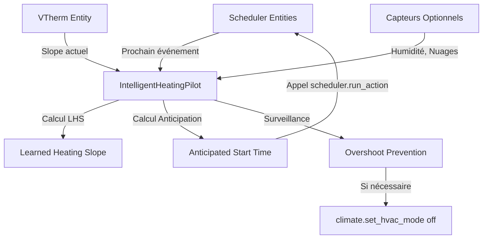

# Architecture d'Intelligent Heating Pilot (IHP)

## Vue d'ensemble

Intelligent Heating Pilot (IHP) agit comme un **intermédiaire intelligent** entre le HACS Scheduler Component et Versatile Thermostat (VTherm). Il apprend des pentes thermiques de votre VTherm et anticipe le démarrage du chauffage pour atteindre la température cible exactement à l'heure programmée.

## Flux de Fonctionnement



## Composants Principaux

### 1. IntelligentHeatingPilotCoordinator

Classe centrale qui gère toute la logique de l'intégration.

#### Responsabilités :
- **Apprentissage des slopes** : Collecte et stocke les valeurs de slope du VTherm
- **Calcul du LHS (Learned Heating Slope)** : Détermine le slope maximal appris
- **Extraction des événements scheduler** : Identifie le prochain déclenchement et sa consigne
- **Calcul d'anticipation** : Détermine quand démarrer le chauffage
- **Planification** : Schedule l'appel à `scheduler.run_action`
- **Surveillance de sur-chauffe** : Prévient le dépassement de la cible

#### Méthodes Clés :

```python
async def async_load() -> None
    """Charge les données persistées (slopes appris)."""

def get_vtherm_slope() -> float
    """Récupère le slope actuel du VTherm et l'ajoute à l'historique."""

def get_learned_heating_slope() -> float
    """Retourne le LHS (max des slopes appris)."""

async def get_next_scheduler_event() -> tuple[datetime, float, str]
    """
    Extrait le prochain événement du scheduler.
    Retourne: (next_time, next_temp, scheduler_entity)
    """

async def async_calculate_anticipation() -> dict
    """
    Calcule le temps d'anticipation basé sur :
    - Delta de température (target - current)
    - LHS (Learned Heating Slope)
    - Facteurs de correction (humidité, nuages)
    
    Formule: Anticipation_min = (ΔT / LHS) * 60 + buffer
    """

async def async_schedule_anticipation(anticipation_data: dict) -> None
    """Planifie l'appel à scheduler.run_action à l'heure anticipée."""

async def async_start_overshoot_monitoring(anticipation_data: dict) -> None
    """
    Surveille toutes les 2 minutes après le démarrage anticipé.
    Si la température risque de dépasser la cible, éteint le chauffage.
    """
```

### 2. Configuration Flow

Gère la configuration initiale et les modifications post-installation.

#### Paramètres :

| Paramètre | Type | Obligatoire | Description |
|-----------|------|-------------|-------------|
| `vtherm_entity_id` | climate | ✅ Oui | Entité Versatile Thermostat (source du slope) |
| `scheduler_entities` | list[switch] | ✅ Oui | Switchs du HACS Scheduler Component |
| `humidity_in_entity_id` | sensor | ❌ Non | Capteur d'humidité intérieure |
| `humidity_out_entity_id` | sensor | ❌ Non | Capteur d'humidité extérieure |
| `cloud_cover_entity_id` | sensor | ❌ Non | Capteur de couverture nuageuse |

### 3. Sensors (Capteurs)

Trois capteurs exposent les données calculées :

#### a) `sensor.intelligent_heating_pilot_anticipated_start_time`
- **Type** : Timestamp
- **Description** : Heure à laquelle le chauffage sera démarré en anticipation
- **Attributs** :
  - `next_schedule_time` : Heure du prochain événement scheduler
  - `next_target_temp` : Température cible du prochain événement
  - `anticipation_minutes` : Durée d'anticipation en minutes
  - `current_temp` : Température actuelle
  - `scheduler_entity` : Entité scheduler concernée
  - `learned_heating_slope` : LHS utilisé pour le calcul

#### b) `sensor.intelligent_heating_pilot_learned_heating_slope`
- **Type** : Mesure (°C/h)
- **Description** : Pente de chauffage apprise (LHS)
- **Attributs** :
  - `max_slope` : Slope maximal enregistré
  - `sample_count` : Nombre d'échantillons collectés
  - `recent_slopes` : 10 derniers slopes mesurés

#### c) `sensor.intelligent_heating_pilot_next_schedule_time`
- **Type** : Timestamp
- **Description** : Heure du prochain événement scheduler
- **Attributs** :
  - `next_target_temp` : Température cible
  - `scheduler_entity` : Entité scheduler source

## Algorithme de Calcul d'Anticipation

### Formule de Base

$$
\text{Anticipation}_{\text{min}} = \frac{T_{\text{target}} - T_{\text{current}}}{\text{LHS} / 60}
$$

Où :
- $T_{\text{target}}$ : Température cible du prochain scheduler
- $T_{\text{current}}$ : Température actuelle de la pièce
- $\text{LHS}$ : Learned Heating Slope (°C/h)

### Facteurs de Correction

#### Humidité Intérieure
Si `humidity_in > 70%` :
$$
\text{Correction}_{\text{humid}} = 1.1
$$
(L'humidité élevée ralentit le chauffage ressenti)

#### Couverture Nuageuse
Si `cloud_cover > 80%` :
$$
\text{Correction}_{\text{cloud}} = 1.05
$$
(Absence de soleil = chauffage plus lent)

### Formule Finale

$$
\text{Anticipation}_{\text{final}} = \text{min}(\text{MAX}, \text{max}(\text{MIN}, \text{Anticipation}_{\text{min}} \times \text{Correction}_{\text{humid}} \times \text{Correction}_{\text{cloud}} + \text{Buffer}))
$$

Avec :
- $\text{MIN} = 10$ minutes
- $\text{MAX} = 180$ minutes (3 heures)
- $\text{Buffer} = 5$ minutes

### Heure de Démarrage Anticipé

$$
\text{Anticipated Start Time} = \text{Next Schedule Time} - \text{Anticipation}_{\text{final}}
$$

## Mécanisme de Prévention de Sur-Chauffe

### Détection

Après le démarrage anticipé, le système vérifie toutes les 2 minutes :

$$
T_{\text{estimated}} = T_{\text{current}} + \left(\text{Slope}_{\text{current}} \times \frac{\text{Time to Schedule}}{60}\right)
$$

### Condition d'Arrêt

Si :
$$
T_{\text{estimated}} > T_{\text{target}} + 0.5°C
$$

Alors :
```python
await hass.services.async_call(
    "climate",
    "set_hvac_mode",
    {"entity_id": vtherm_entity, "hvac_mode": "off"},
    blocking=True,
)
```

## Persistance des Données

### Fichier de Stockage

Emplacement : `.storage/intelligent_heating_pilot_storage_{entry_id}`

Structure :
```json
{
    "version": 1,
    "data": {
        "learned_slopes": [2.1, 2.3, 2.0, ...],
        "max_heating_slope": 2.3
    }
}
```

### Gestion de l'Historique

- Maximum 100 valeurs de slope conservées
- Mise à jour du `max_heating_slope` à chaque ajout
- Sauvegarde asynchrone après chaque modification

## Intégration avec Scheduler Component

### Défi Technique

L'extraction du prochain événement du scheduler nécessite d'analyser les attributs des entités switch du scheduler.

Voir le fichier `SCHEDULER_INTEGRATION.md` pour les détails d'implémentation.

### Actions

#### Déclenchement Anticipé
```python
await hass.services.async_call(
    "scheduler",
    "run_action",
    {"entity_id": scheduler_entity_id},
    blocking=True,
)
```

Cela déclenche immédiatement l'action programmée (changement de consigne du VTherm).

## Événements Home Assistant

### `intelligent_heating_pilot_anticipation_calculated`

Déclenché après chaque calcul d'anticipation réussi.

**Données** :
```python
{
    "anticipated_start_time": datetime,
    "next_schedule_time": datetime,
    "next_target_temp": float,
    "anticipation_minutes": float,
    "current_temp": float,
    "scheduler_entity": str,
    "learned_heating_slope": float,
}
```

## État des Listeners

Le coordinator maintient des listeners sur :
- **VTherm entity** : Pour capturer les changements de slope et température
- **Scheduler entities** : Pour détecter les modifications de planning
- **Capteurs optionnels** : Humidité, couverture nuageuse

Tout changement d'état déclenche un appel à `coordinator.async_update()`.

## Exemple de Flux Complet

1. **7h00** : L'utilisateur configure un scheduler pour 21°C à 19h00
2. **18h30** : SmartStarterVTherm détecte le prochain événement (19h00, 21°C)
3. **18h30** : Température actuelle = 18°C, LHS = 2°C/h
4. **18h30** : Calcul :
   - ΔT = 21 - 18 = 3°C
   - Anticipation base = (3 / 2) × 60 = 90 min
   - Avec buffer = 95 min
   - Démarrage anticipé = 19h00 - 95min = **17h25**
5. **17h25** : Appel à `scheduler.run_action` → VTherm passe à 21°C
6. **17h25-19h00** : Monitoring toutes les 2 min
7. **18h50** : Si T_estimated > 21.5°C → Arrêt du chauffage
8. **19h00** : Objectif atteint, température = ~21°C

## Constantes Configurables

Dans `const.py` :

```python
DEFAULT_HEATING_SLOPE = 2.0  # °C/h - Slope par défaut avant apprentissage
DEFAULT_ANTICIPATION_BUFFER = 5  # minutes - Buffer de sécurité
MIN_ANTICIPATION_TIME = 10  # minutes - Anticipation minimale
MAX_ANTICIPATION_TIME = 180  # minutes - Anticipation maximale (3h)
```

## Debugging

Activer les logs détaillés dans `configuration.yaml` :

```yaml
logger:
  default: info
  logs:
    custom_components.intelligent_heating_pilot: debug
```

Les logs incluent :
- Valeurs de slope collectées
- Calculs d'anticipation détaillés
- Attributs des entités scheduler
- Détection de sur-chauffe
- Appels de services

## Limitations Actuelles

1. **Extraction Scheduler** : La méthode `get_next_scheduler_event()` contient du code placeholder. Elle doit être adaptée à la structure réelle des attributs du HACS Scheduler Component.

2. **Multi-VTherm** : Version actuelle gère un seul VTherm par instance.

3. **Zones** : Pas de gestion des zones multiples.

4. **Apprentissage Contextuel** : Le LHS est global, pas spécifique aux conditions météo.

## Évolutions Futures

- [ ] Apprentissage contextuel (LHS selon température extérieure)
- [ ] Support multi-zones
- [ ] Intégration avec prévisions météo
- [ ] Mode "apprentissage" initial avec recommandations
- [ ] Dashboard dédié pour visualiser les slopes et anticipations
- [ ] Support d'autres schedulers (Google Calendar, etc.)
